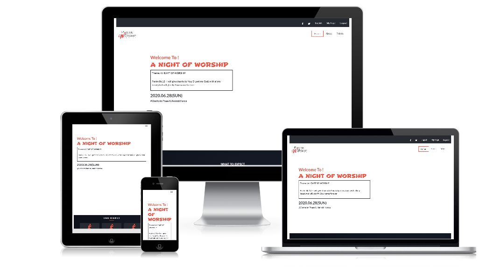

# Conference Page
HTML & CSS capstone project: Conference Page

# Screenshot

This project is based on an online website for a conference. I customized it to a christian concert with three pages, i.e homepage, about us and ticket page.

## Built With

- HTML and CSS

- Bootstrap

## Live Demo

[Live Demo Link](https://mimipeshy.github.io/conference-page/)

## Getting Started

To get a local copy up and running follow these simple example steps.

### Prerequisites

Install `git` on your local machine

### Setup

Type `git init` in your local terminal

### Install

Clone the repository to your local machine `https://github.com/mimipeshy/conference-page.git ` 

### Usage

Cd into the repository `cd conference-page`

Open the `index.html` file and run it with any browser of your choice

## Authors

👤 **Mimi Peshy**

- Github: [@githubhandle](https://github.com/mimipeshy)
- LinkedIn: [@linkedinhandle](https://www.linkedin.com/in/peris-ndanu-405083193/)

## 🤝 Contributing

Contributions, issues and feature requests are welcome!

Feel free to check the [issues page](issues/).

## Show your support

Give a ⭐️ if you like this project!

## Acknowledgments

- Hat tip to anyone whose code was used
- Inspiration
- etc

## 📝 License

This project is [MIT](lic.url) licensed.
